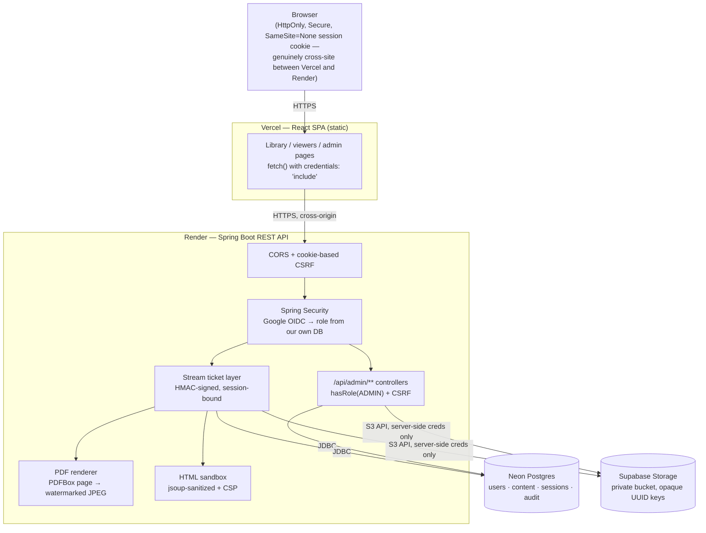

# Secure Content Portal

A role-based portal for sharing training and reference content — video, PDF, and HTML — inside an
organization. Admins upload and manage content; viewers browse and watch/read it inline, without a
working path to save the original file.

Built for an internship screening assignment. Java Spring Boot was a hard requirement; everything
else below was chosen deliberately, not defaulted to.

**Live app:** https://secure-content-portal.vercel.app (React frontend — talks to the API below)
**API:** https://secure-content-portal.onrender.com
**Repo:** https://github.com/Abishek062006/secure-content-portal

> First load can take 30–60 seconds — the free-tier API instance sleeps after 15 minutes of
> inactivity and cold-starts on the next request. This is expected; see [Deployment](#deployment).

---

## Contents

- [Features](#features)
- [Tech stack, and why](#tech-stack-and-why)
- [Architecture](#architecture)
- [Running it locally](#running-it-locally)
- [Environment variables](#environment-variables)
- [Deployment](#deployment)
- [Content protection — what's real, what's a deterrent](#content-protection--whats-real-what-a-deterrent)
- [Security practices](#security-practices)
- [Testing](#testing)
- [Bonus features implemented](#bonus-features-implemented)
- [Known limitations and assumptions](#known-limitations-and-assumptions)
- [What I'd do with more time](#what-id-do-with-more-time)

---

## Features

**Everyone (after Google sign-in)**
- Browse a searchable, filterable library of videos, PDFs and HTML pages
- Watch video inline with seeking (range-request streaming)
- Read PDFs page-by-page as rendered images
- View HTML pages sandboxed

**Admins** (seeded via an email allow-list, not self-service)
- Upload video/PDF/HTML with title, description, category
- Edit metadata; delete with a confirmation dialog
- View per-item view counts and last-viewed timestamps
- Audit log of every upload/edit/delete, with who and when

## Tech stack, and why

| Layer | Choice | Why |
|---|---|---|
| Backend | Spring Boot 3.5, Java 21 | The assignment's one hard requirement |
| Frontend | React (Vite) SPA, deployed separately on Vercel | Talks to the backend as a JSON REST API over `/api/**`. This is a genuine cross-origin setup (see [Deployment](#deployment) for the `SameSite=None` trade-off it requires), not a same-origin monolith — the earlier same-origin Thymeleaf build is still in this repo's history if you want to see that version |
| Auth | Spring Security `oauth2-client` | Server-side session only; no JWT in localStorage. Role is decided by *our* database, never trusted from the OAuth response |
| Sessions | Spring Session JDBC (Postgres) | Sessions survive a redeploy or a free-tier restart, since they don't live in that process's memory |
| Database | [Neon](https://neon.tech) Postgres | Free-tier Neon *branches* auto-resume in under a second; Supabase's free-tier *projects* pause after 7 days idle, which is a real risk for a reviewer opening this after a week |
| File storage | [Supabase Storage](https://supabase.com) (private bucket, S3-compatible API) | 1GB free, no card required, and the S3-compatible endpoint means the code isn't locked to Supabase specifically |
| PDF rendering | Apache PDFBox | Renders pages to images server-side — see [Content protection](#content-protection--whats-real-what-a-deterrent) |
| File-type detection | Apache Tika | Magic-byte sniffing — never trusts the filename extension or the browser's `Content-Type` header |
| HTML sanitizing | jsoup | Strips scripts/forms/event handlers at upload time |
| Backend hosting | [Render](https://render.com) free web service, Docker | Builds the Dockerfile in the cloud — no local Docker needed |
| Frontend hosting | [Vercel](https://vercel.com) free tier | Zero-config Vite build, instant deploys on push |

## Architecture



The browser never learns a storage key, never receives a storage credential, never holds a URL
that outlives its session, and never stores an auth token itself — the session cookie is the only
credential, and it's `HttpOnly` so the SPA's own JavaScript can't read it either.

## Running it locally

**Prerequisites:** Java 21, Maven, Node 18+, and the accounts described in
[Environment variables](#environment-variables) (Google OAuth client, Neon database, Supabase bucket).

Backend:

```bash
git clone https://github.com/Abishek062006/secure-content-portal.git
cd secure-content-portal
cp .env.example .env
# fill in .env with your own credentials — see below
./run-local.sh
```

`run-local.sh` sources `.env` and runs `mvn spring-boot:run`. The API starts on
`http://localhost:8080`; Flyway builds the schema automatically on first run.

Frontend (in a second terminal):

```bash
cd frontend
npm install
npm run dev
```

Starts on `http://localhost:5173` and talks to the backend above (`.env.development` already
points `VITE_API_URL` at `http://localhost:8080`). Both need to be running to sign in and browse.

To run the test suite:

```bash
set -a; source .env; set +a
mvn test
```

`AccessControlTest` boots the full app against your real Postgres database (same as running the
app), so it needs `.env` sourced. `FileValidatorTest` and `StreamTicketServiceTest` are plain unit
tests with no external dependencies.

## Environment variables

All variables are listed with placeholders in [`.env.example`](.env.example). None are committed
with real values.

| Variable | Where it comes from |
|---|---|
| `GOOGLE_CLIENT_ID`, `GOOGLE_CLIENT_SECRET` | Google Cloud Console → APIs & Services → Credentials |
| `DB_URL`, `DB_USERNAME`, `DB_PASSWORD` | Neon project → Connection Details (use the **pooled** connection string) |
| `STORAGE_ENDPOINT`, `STORAGE_REGION`, `STORAGE_BUCKET`, `STORAGE_ACCESS_KEY`, `STORAGE_SECRET_KEY` | Supabase project → Storage → S3 Connection |
| `APP_ADMIN_EMAILS` | Comma-separated list of emails that should be promoted to Admin on login |
| `APP_TICKET_SECRET` | Random secret for signing stream tickets — generate with `openssl rand -base64 32`. **Use a different one in production than in development.** |
| `APP_FRONTEND_URL` | The deployed frontend's origin (e.g. `https://secure-content-portal.vercel.app`) — used for CORS and as the post-login/logout redirect target. Defaults to `http://localhost:5173` for local dev |

The frontend has its own, much smaller set: `VITE_API_URL`, the backend's origin — see
[`frontend/.env.development`](frontend/.env.development) and
[`frontend/.env.production`](frontend/.env.production).

## Deployment

| Piece | Service | Free tier |
|---|---|---|
| API | Render (Docker web service) | 512MB RAM, sleeps after 15 min idle |
| Frontend | Vercel | Static build, no sleep/cold-start |
| Database | Neon Postgres | Auto-resumes in <1s when idle |
| File storage | Supabase Storage | 1GB, 50MB per-file cap |
| OAuth | Google Cloud | Free, no verification needed for the non-sensitive scopes used here |

The Dockerfile is a two-stage build (`maven:3.9-eclipse-temurin-21` to compile,
`eclipse-temurin:21-jre-alpine` to run as a non-root user) and skips tests during the image build —
`AccessControlTest` needs a real Postgres connection Render's build step doesn't have, and tests are
a dev-time check, not a deploy-time gate. On Vercel, set the project's Root Directory to `frontend/`
and its `VITE_API_URL` env var to the Render API's URL.

**Two deployment-specific gotchas worth knowing:**

1. Render terminates TLS upstream of the container, so without
   `server.forward-headers-strategy=native` (set in `application-prod.yml`), Spring builds the OAuth
   callback URL as `http://` and Google rejects it. This is set correctly here, but it's the first
   thing to check if OAuth breaks only in production and not locally.
2. Vercel and Render are genuinely different registrable domains, so the session cookie has to be
   `SameSite=None` in production (`application-prod.yml`) — `Lax` would never be sent on the SPA's
   cross-site `fetch()` calls at all. `SameSite=None` requires `Secure`, which is also set; both
   services are HTTPS-only in production, so this doesn't weaken anything, but it's a real
   architectural cost of splitting the frontend out that a same-origin deployment wouldn't have.
   `APP_FRONTEND_URL` on Render must exactly match the deployed Vercel origin for CORS to allow it.

**Cold starts:** the free Render instance sleeps after 15 minutes of no traffic and takes 30–60
seconds to wake on the next request. This is a known, accepted trade-off of the free tier, not a
bug — the Vercel-hosted frontend itself loads instantly either way, but its first API calls will
wait on the backend waking up.

## Content protection — what's real, what's a deterrent

The assignment is explicit that hiding a download button isn't security. Here's an honest breakdown
of what actually stops a determined viewer versus what just discourages a casual one.

### Real boundaries

- **Nothing is served from a public or guessable URL.** Every video byte, PDF page image, and HTML
  page goes through `/api/stream/{ticket}`, `/api/pdf/{ticket}/page/{n}`, or `/api/html/{ticket}` —
  never a direct storage link. The Supabase bucket itself is private; even its raw S3 endpoint
  refuses unsigned requests.
- **Tickets are session-bound, not just expiring.** Each ticket is an HMAC-signed token carrying the
  content ID, the requesting user, a hash of their session ID, a purpose, and an expiry
  (`StreamTicketService`). A URL copied out of devtools and opened in a different browser — even one
  logged into a different valid account — fails immediately, because the session hash won't match.
  Most implementations stop at "the link expires eventually"; this stops working the moment it's
  used anywhere else.
- **The PDF binary never reaches the browser.** Pages are rendered server-side to JPEG with
  PDFBox and served as images. There is no PDF file for the browser to hold in memory and save —
  unlike a client-side viewer (e.g. PDF.js), where the whole file is fetched and sits in the page's
  memory regardless of what UI chrome is disabled around it.
- **HTML is sanitized at upload, not just at serve time**, and delivered inside an iframe with a
  bare `sandbox` Content-Security-Policy — no `allow-same-origin`, so the framed document gets a
  null origin and cannot read cookies, call back to the app, or navigate the parent page.
- **Server-side role checks, twice.** `/admin/**` is enforced at the URL level in `SecurityConfig`
  *and* independently via `@PreAuthorize` on the controller — a routing mistake in one layer can't
  expose an admin action, because the other still catches it.

### Deterrents only

- Disabling the video's right-click/download affordances (`controlsList="nodownload"`) — a browser
  setting, not a security boundary. Anyone can still screen-record playback.
- The video/PDF page never being watermarked with the viewer's identity for video (only PDF pages
  are watermarked in this build) — see [What I'd do with more time](#what-id-do-with-more-time).
- Nothing here stops a sufficiently motivated person with screen-recording software. That's true of
  any content protection scheme that still has to render pixels to a real screen; the point of this
  design is to stop casual link-sharing and devtools scraping, not to build DRM.

## Security practices

- **Three independent upload checks**: file extension, size ceiling, and the file's actual magic
  bytes via Tika — content wins over both the extension and the browser-supplied `Content-Type`,
  both of which are attacker-controlled. A renamed executable or text file is rejected regardless of
  what extension it's given.
- **No secrets in the repository.** `.env` is gitignored; `.env.example` documents every key with
  placeholder values only.
- **CSRF protection is on** (Spring Security's default) for every state-changing request, including
  logout — which is why logout is a POST form, not a link.
- **HttpOnly, Secure (in production) session cookie.** `SameSite=None` in production, required
  because the frontend and API are on different domains (see [Deployment](#deployment)); `Lax`
  locally, where frontend and backend share the same registrable domain. No token is ever stored in
  localStorage or sessionStorage.

## Testing

```
mvn test
```

| Suite | What it covers | Needs a real DB? |
|---|---|---|
| `FileValidatorTest` (13 cases) | Extension/size/magic-byte checks; a renamed text file or executable is rejected regardless of its extension or claimed `Content-Type` | No |
| `StreamTicketServiceTest` (8 cases) | Tampered signature, payload swapped under a stolen signature, wrong session, no session, expired ticket | No |
| `AccessControlTest` (9 cases) | Anonymous/viewer/admin against every `/api/admin/**` route, the delete route, `/api/content`, and all three content-delivery endpoints, through the real Spring Security filter chain | Yes |

## Bonus features implemented

- Per-item view count and last-viewed timestamp, visible to admins only
- Search and filter on the library (title/description text search, content type, category)
- Audit log of admin actions (upload/edit/delete) with actor, timestamp and detail
- Access-control test suite (see [Testing](#testing))

## Known limitations and assumptions

- **PDF page-render cache isn't swept on delete.** Deleting a PDF removes its database row and the
  original file, but cached rendered pages under `derived/<id>/` in storage are left behind — they're
  unreachable (nothing can mint a ticket for a deleted item) but not reclaimed.
- **Video isn't watermarked**, only PDF pages are. Both were in scope; PDF was prioritized as the
  format where server-side rendering is also the main security boundary, not just a deterrent.
- **No silent ticket refresh for long videos.** A video ticket is valid for 30 minutes; a video
  longer than that would need to be reloaded. Chosen over building refresh logic given the time
  available — see below.
- Assumed "basic view tracking" (a stated bonus) means a raw count is enough — no per-user dedup, no
  analytics dashboard.

## What I'd do with more time

- Silent stream-ticket refresh for the video player, so long videos don't hit the 30-minute ceiling
  mid-playback
- Watermark video the same way PDF pages are watermarked
- HLS-based video delivery instead of a single progressive stream, for adaptive quality
- A scheduled job to sweep orphaned PDF page-render caches after a content item is deleted
- Rate-limit ticket minting per user, as a defense against a compromised session being used to
  script mass content scraping
