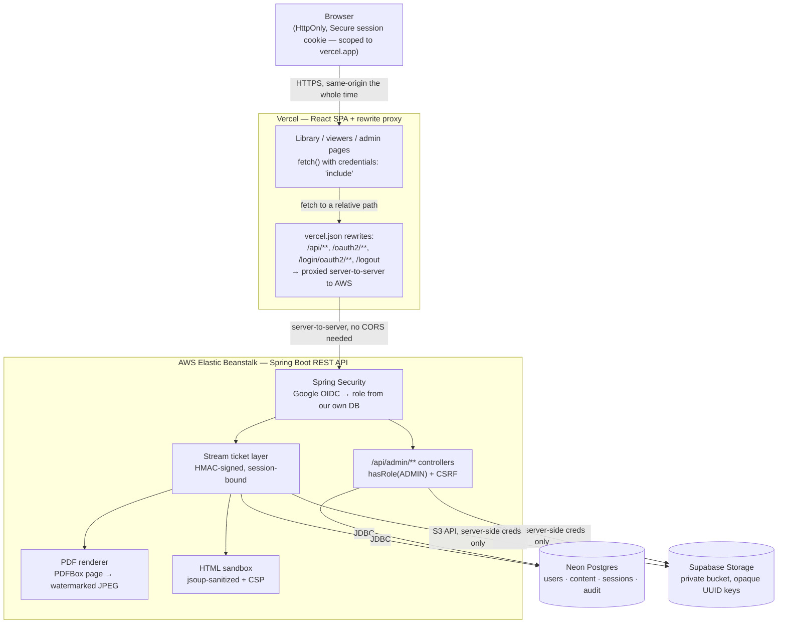

# Secure Content Portal

A role-based portal for sharing training and reference content — video, PDF, and HTML — inside an
organization. Admins upload and manage content; viewers browse and watch/read it inline, without a
working path to save the original file.

Built for an internship screening assignment. Java Spring Boot was a hard requirement; everything
else below was chosen deliberately, not defaulted to.

**Live app:** https://secure-content-portal.vercel.app (React frontend — talks to the API below)
**API:** AWS Elastic Beanstalk (Docker, `eu-north-1`), proxied through Vercel — see [Deployment](#deployment)
**Repo:** https://github.com/Abishek062006/secure-content-portal

---

## Contents

- [Features](#features)
- [Tech stack, and why](#tech-stack-and-why)
- [Architecture](#architecture)
- [Running it locally](#running-it-locally)
- [Environment variables](#environment-variables)
- [Deployment](#deployment)
- [Content protection — what's real, what's a deterrent](#content-protection--whats-real-what-a-deterrent)
- [Security practices](#security-practices)
- [Testing](#testing)
- [Bonus features implemented](#bonus-features-implemented)
- [Known limitations and assumptions](#known-limitations-and-assumptions)
- [What I'd do with more time](#what-id-do-with-more-time)

---

## Features

**Everyone (after Google sign-in)**
- Browse a searchable, filterable library of videos, PDFs and HTML pages
- Watch video inline with seeking (range-request streaming)
- Read PDFs page-by-page as rendered images
- View HTML pages sandboxed

**Admins** (seeded via an email allow-list, not self-service)
- Upload video/PDF/HTML with title, description, category
- Edit metadata; delete with a confirmation dialog
- View per-item view counts and last-viewed timestamps
- Audit log of every upload/edit/delete, with who and when

## Tech stack, and why

| Layer | Choice | Why |
|---|---|---|
| Backend | Spring Boot 3.5, Java 21 | The assignment's one hard requirement |
| Frontend | React (Vite) SPA, deployed separately on Vercel | Talks to the backend as a JSON REST API over `/api/**`, routed through Vercel's own rewrite proxy rather than plain cross-origin CORS (see [Architecture](#architecture) for why). Not a same-origin monolith — the earlier same-origin Thymeleaf build is still in this repo's history if you want to see that version |
| UI design | Inter (Google Fonts), CSS custom properties, no component library | Layered shadows, pill-shaped controls, hover/press micro-interactions, per-route fade-up entrances, a glassmorphic sign-in screen with gradient glow accents, and gradient-text page headings — all in `frontend/src/app.css`, applied via the existing shared classes so no page needed individual rework |
| Auth | Spring Security `oauth2-client` | Server-side session only; no JWT in localStorage. Role is decided by *our* database, never trusted from the OAuth response |
| Sessions | Spring Session JDBC (Postgres) | Sessions survive a redeploy or a free-tier restart, since they don't live in that process's memory |
| Database | [Neon](https://neon.tech) Postgres | Free-tier Neon *branches* auto-resume in under a second; Supabase's free-tier *projects* pause after 7 days idle, which is a real risk for a reviewer opening this after a week |
| File storage | [Supabase Storage](https://supabase.com) (private bucket, S3-compatible API) | 1GB free, no card required, and the S3-compatible endpoint means the code isn't locked to Supabase specifically |
| PDF rendering | Apache PDFBox, 90 DPI | Renders pages to images server-side — see [Content protection](#content-protection--whats-real-what-a-deterrent). DPI kept modest since every render (even a cache hit) still redoes an in-memory decode/watermark/re-encode on a small single-core instance |
| File-type detection | Apache Tika | Magic-byte sniffing — never trusts the filename extension or the browser's `Content-Type` header |
| HTML sanitizing | jsoup | Strips scripts/forms/event handlers at upload time |
| Backend hosting | AWS Elastic Beanstalk (Docker on `t3.micro`, single instance) | Builds the same Dockerfile the repo already had — no separate deploy config needed. Moved off Render mid-project because Render's free tier sleeps after 15 min idle and cold-starts 30–60s on the next request; EB's free-tier instance runs continuously instead |
| Frontend hosting | [Vercel](https://vercel.com) free tier | Zero-config Vite build, instant deploys on push |

## Architecture



The browser never learns a storage key, never receives a storage credential, never holds a URL
that outlives its session, and never stores an auth token itself — the session cookie is the only
credential, and it's `HttpOnly` so the SPA's own JavaScript can't read it either.

**Why a proxy instead of plain cross-origin CORS + cookies** (the first approach tried): browsers
now block third-party cookies by default, which broke the whole flow for anyone but a session that
happened to already be trusted — sign-in would appear to succeed, but every subsequent `fetch()`
from `vercel.app` to the backend's own domain silently dropped the session cookie. Routing
everything through Vercel's own rewrites means the browser only ever talks to `vercel.app`; Vercel
forwards to the backend server-to-server, so the session cookie ends up scoped to Vercel's own
origin and every API call is same-origin from the browser's point of view. `frontend/vercel.json`
holds the rewrite rules; `VITE_API_URL` is intentionally empty in production so the frontend calls
relative paths. This also means the backend can move — Render to AWS, or anywhere else — by
changing only the destination URLs in `vercel.json`; nothing about Google OAuth or the frontend
needs to know or care.

## Running it locally

**Prerequisites:** Java 21, Maven, Node 18+, and the accounts described in
[Environment variables](#environment-variables) (Google OAuth client, Neon database, Supabase bucket).

Backend:

```bash
git clone https://github.com/Abishek062006/secure-content-portal.git
cd secure-content-portal
cp .env.example .env
# fill in .env with your own credentials — see below
./run-local.sh
```

`run-local.sh` sources `.env` and runs `mvn spring-boot:run`. The API starts on
`http://localhost:8080`; Flyway builds the schema automatically on first run.

Frontend (in a second terminal):

```bash
cd frontend
npm install
npm run dev
```

Starts on `http://localhost:5173` and talks to the backend above (`.env.development` already
points `VITE_API_URL` at `http://localhost:8080`). Both need to be running to sign in and browse.

To run the test suite:

```bash
set -a; source .env; set +a
mvn test
```

`AccessControlTest` boots the full app against your real Postgres database (same as running the
app), so it needs `.env` sourced. `FileValidatorTest` and `StreamTicketServiceTest` are plain unit
tests with no external dependencies.

## Environment variables

All variables are listed with placeholders in [`.env.example`](.env.example). None are committed
with real values.

| Variable | Where it comes from |
|---|---|
| `GOOGLE_CLIENT_ID`, `GOOGLE_CLIENT_SECRET` | Google Cloud Console → APIs & Services → Credentials |
| `DB_URL`, `DB_USERNAME`, `DB_PASSWORD` | Neon project → Connection Details (use the **pooled** connection string) |
| `STORAGE_ENDPOINT`, `STORAGE_REGION`, `STORAGE_BUCKET`, `STORAGE_ACCESS_KEY`, `STORAGE_SECRET_KEY` | Supabase project → Storage → S3 Connection |
| `APP_ADMIN_EMAILS` | Comma-separated list of emails that should be promoted to Admin on login |
| `APP_TICKET_SECRET` | Random secret for signing stream tickets — generate with `openssl rand -base64 32`. **Use a different one in production than in development.** |
| `APP_FRONTEND_URL` | The deployed frontend's origin (e.g. `https://secure-content-portal.vercel.app`) — used for CORS and as the post-login/logout redirect target. Defaults to `http://localhost:5173` for local dev |

The frontend has its own, much smaller set: `VITE_API_URL`, the backend's origin — see
[`frontend/.env.development`](frontend/.env.development) and
[`frontend/.env.production`](frontend/.env.production).

## Deployment

| Piece | Service | Free tier |
|---|---|---|
| API | AWS Elastic Beanstalk (Docker, `t3.micro`, single instance, `eu-north-1`) | 750 instance-hours/month free for 12 months on a new AWS account; no sleep/cold-start |
| Frontend | Vercel | Static build, no sleep/cold-start |
| Database | Neon Postgres | Auto-resumes in <1s when idle |
| File storage | Supabase Storage | 1GB, 50MB per-file cap |
| OAuth | Google Cloud | Free, no verification needed for the non-sensitive scopes used here |

The Dockerfile is a two-stage build (`maven:3.9-eclipse-temurin-21` to compile,
`eclipse-temurin:21-jre-alpine` to run as a non-root user) and skips tests during the image build —
`AccessControlTest` needs a real Postgres connection the build step doesn't have, and tests are
a dev-time check, not a deploy-time gate. EB's Docker platform builds this same Dockerfile directly
from an uploaded source zip and auto-detects the exposed port from `EXPOSE 8080` — no extra deploy
config needed. On Vercel, set the project's Root Directory to `frontend/` and leave `VITE_API_URL`
**unset** in the dashboard — the committed `frontend/.env.production` sets it to empty intentionally,
and a dashboard value would silently override that (see gotcha #2 below).

**Why AWS instead of Render:** the project started on Render's free tier, which works but sleeps
after 15 minutes of idle and cold-starts 30–60s on the next request. It was migrated mid-project to
an AWS Elastic Beanstalk `t3.micro` instance (Single instance environment type, so no load balancer
— keeps it inside the free tier) once that cold-start became the main complaint. File storage stayed
on Supabase throughout; only the compute layer moved. The migration needed no changes to Google
OAuth config or to Vercel's dashboard — see the proxy rationale above for why.

**Deployment-specific gotchas worth knowing — all hit for real while building this:**

1. Both Render and, now, Vercel terminate TLS upstream of the container, so without
   `server.forward-headers-strategy=native` (set in `application-prod.yml`), Spring builds the OAuth
   callback URL as `http://` and Google rejects it. This is set correctly here, but it's the first
   thing to check if OAuth breaks only in production and not locally.
2. **Vercel dashboard environment variables silently win over the committed `.env.production` file.**
   `VITE_API_URL` was set once in Vercel's dashboard UI while first wiring up the project, then later
   made intentionally empty in `frontend/.env.production` — but the dashboard value kept overriding
   it on every rebuild, with no error or warning, so the deployed app kept calling Render directly
   instead of through the proxy no matter what the code said. If a Vite env var isn't behaving as the
   repo says it should on Vercel, check the dashboard for a stale override before anything else.
3. **The OAuth "pending request" can't safely live in a cookie or session across the redirect
   through Google, in production.** The natural fix for a proxied setup — store the
   `OAuth2AuthorizationRequest` in a cookie instead of `HttpSession` — worked perfectly when replayed
   with curl (an explicit cookie jar, no real Google visit), every single time, and still failed
   identically in real browsers with `authorization_request_not_found`. The actual fix
   (`StatelessOAuth2AuthorizationRequestResolver` / `...Repository`, in `com.secureportal.config`)
   encodes the whole request into the `state` parameter itself — Google is contractually required to
   echo `state` back verbatim over a plain URL parameter, so there's nothing left for a cookie policy
   or a redirect-chain quirk to interfere with. See the class Javadoc for the full story; this is the
   single most subtle thing in the whole project and worth reading if OAuth-behind-a-proxy ever comes
   up again.
4. Vercel and the backend (Render before, AWS now) are genuinely different registrable domains at
   the DNS level, so the session cookie is still `SameSite=None; Secure` in production
   (`application-prod.yml`) as a defensive default — but because of gotcha #3 and the proxy in #2's
   fix, the cookie is actually *set* while the browser is talking to `vercel.app` (proxied), so it
   ends up scoped there rather than to the backend, and every later API call is same-origin from the
   browser's perspective regardless. `APP_FRONTEND_URL` on the backend must still exactly match the
   deployed Vercel origin, for CORS (kept as defense-in-depth) and as the post-login redirect target.

**No cold starts on AWS:** Render's free tier slept after 15 minutes of no traffic and took 30–60
seconds to wake on the next request — a known, accepted trade-off at the time, not a bug. That's
the main thing the AWS migration fixed: the EB `t3.micro` instance runs continuously within the
free tier, so there's no sleep/wake cycle to wait on anymore.

## Content protection — what's real, what's a deterrent

The assignment is explicit that hiding a download button isn't security. Here's an honest breakdown
of what actually stops a determined viewer versus what just discourages a casual one.

### Real boundaries

- **Nothing is served from a public or guessable URL.** Every video byte, PDF page image, and HTML
  page goes through `/api/stream/{ticket}`, `/api/pdf/{ticket}/page/{n}`, or `/api/html/{ticket}` —
  never a direct storage link. The Supabase bucket itself is private; even its raw S3 endpoint
  refuses unsigned requests.
- **Tickets are session-bound, not just expiring.** Each ticket is an HMAC-signed token carrying the
  content ID, the requesting user, a hash of their session ID, a purpose, and an expiry
  (`StreamTicketService`). A URL copied out of devtools and opened in a different browser — even one
  logged into a different valid account — fails immediately, because the session hash won't match.
  Most implementations stop at "the link expires eventually"; this stops working the moment it's
  used anywhere else.
- **The PDF binary never reaches the browser.** Pages are rendered server-side to JPEG with
  PDFBox and served as images. There is no PDF file for the browser to hold in memory and save —
  unlike a client-side viewer (e.g. PDF.js), where the whole file is fetched and sits in the page's
  memory regardless of what UI chrome is disabled around it.
- **HTML is sanitized at upload, not just at serve time**, and delivered inside an iframe with a
  bare `sandbox` Content-Security-Policy — no `allow-same-origin`, so the framed document gets a
  null origin and cannot read cookies, call back to the app, or navigate the parent page.
- **Server-side role checks, twice.** `/admin/**` is enforced at the URL level in `SecurityConfig`
  *and* independently via `@PreAuthorize` on the controller — a routing mistake in one layer can't
  expose an admin action, because the other still catches it.

### Deterrents only

- **Video's watermark is CSS, not pixels.** PDF's watermark is burned into the rendered JPEG
  server-side — a real boundary, since there's no unwatermarked version to recover. Video's is a
  translucent overlay drawn on top of the `<video>` element in the browser (`VideoViewer.jsx`),
  showing the same tiled-diagonal look. True server-side burned-in video watermarking would mean
  real-time per-viewer frame transcoding (ffmpeg), which would fight the simple range-request
  seeking the player relies on and likely be too slow on a free-tier instance's CPU — out of scope
  for what this needed to prove. The brief itself frames this bonus as a deterrent, not a security
  boundary, so this is an honest match for what was actually asked.
- **Right-click "Save Video As" is disabled** (`onContextMenu` preventing the browser's native
  context menu) and native fullscreen is suppressed (`playsInline`, plus an explicit
  `webkitbeginfullscreen` listener backing iOS out of it — Safari ignores `controlsList` for this
  entirely) so the watermark overlay can't be trivially bypassed by handing the video to the OS's
  own fullscreen surface. Both are UI-level deterrents: the underlying stream URL was already
  ticket-gated and session-bound regardless — see [Real boundaries](#real-boundaries) above.
- Nothing here stops a sufficiently motivated person with screen-recording software. That's true of
  any content protection scheme that still has to render pixels to a real screen; the point of this
  design is to stop casual link-sharing and devtools scraping, not to build DRM.

## Security practices

- **Three independent upload checks**: file extension, size ceiling, and the file's actual magic
  bytes via Tika — content wins over both the extension and the browser-supplied `Content-Type`,
  both of which are attacker-controlled. A renamed executable or text file is rejected regardless of
  what extension it's given.
- **No secrets in the repository.** `.env` is gitignored; `.env.example` documents every key with
  placeholder values only.
- **CSRF protection is on** (Spring Security's default) for every state-changing request, including
  logout — which is why logout is a POST form, not a link.
- **HttpOnly, Secure (in production) session cookie.** `SameSite=None` in production, required
  because the frontend and API are on different domains (see [Deployment](#deployment)); `Lax`
  locally, where frontend and backend share the same registrable domain. No token is ever stored in
  localStorage or sessionStorage.

## Testing

```
mvn test
```

| Suite | What it covers | Needs a real DB? |
|---|---|---|
| `FileValidatorTest` (13 cases) | Extension/size/magic-byte checks; a renamed text file or executable is rejected regardless of its extension or claimed `Content-Type` | No |
| `StreamTicketServiceTest` (8 cases) | Tampered signature, payload swapped under a stolen signature, wrong session, no session, expired ticket | No |
| `AccessControlTest` (9 cases) | Anonymous/viewer/admin against every `/api/admin/**` route, the delete route, `/api/content`, and all three content-delivery endpoints, through the real Spring Security filter chain | Yes |

## Bonus features implemented

- Per-item view count and last-viewed timestamp, visible to admins only
- Search and filter on the library (title/description text search, content type, category)
- Watermarking the viewer's email onto video and PDF views as a deterrent (server-side/real for
  PDF, CSS overlay for video — see [Deterrents only](#deterrents-only))
- Audit log of admin actions (upload/edit/delete, and admin grant/revoke) with actor, timestamp
  and detail
- Access-control test suite (see [Testing](#testing))

All five bonus items from the brief are implemented.

## Known limitations and assumptions

- **PDF page-render cache isn't swept on delete.** Deleting a PDF removes its database row and the
  original file, but cached rendered pages under `derived/<id>/` in storage are left behind — they're
  unreachable (nothing can mint a ticket for a deleted item) but not reclaimed.
- **Video's watermark is a CSS overlay, not burned into the file**, unlike PDF's. See
  [Deterrents only](#deterrents-only) for why that's the honest trade-off here, not an oversight.
- **No silent ticket refresh for long videos.** A video ticket is valid for 30 minutes; a video
  longer than that would need to be reloaded. Chosen over building refresh logic given the time
  available — see below.
- Assumed "basic view tracking" (a stated bonus) means a raw count is enough — no per-user dedup, no
  analytics dashboard.

## What I'd do with more time

- Silent stream-ticket refresh for the video player, so long videos don't hit the 30-minute ceiling
  mid-playback
- Real server-side video watermarking (ffmpeg-based frame transcoding) instead of the CSS overlay,
  if the seeking/CPU trade-offs it brings turned out to be worth it
- HLS-based video delivery instead of a single progressive stream, for adaptive quality
- A scheduled job to sweep orphaned PDF page-render caches after a content item is deleted
- Rate-limit ticket minting per user, as a defense against a compromised session being used to
  script mass content scraping
