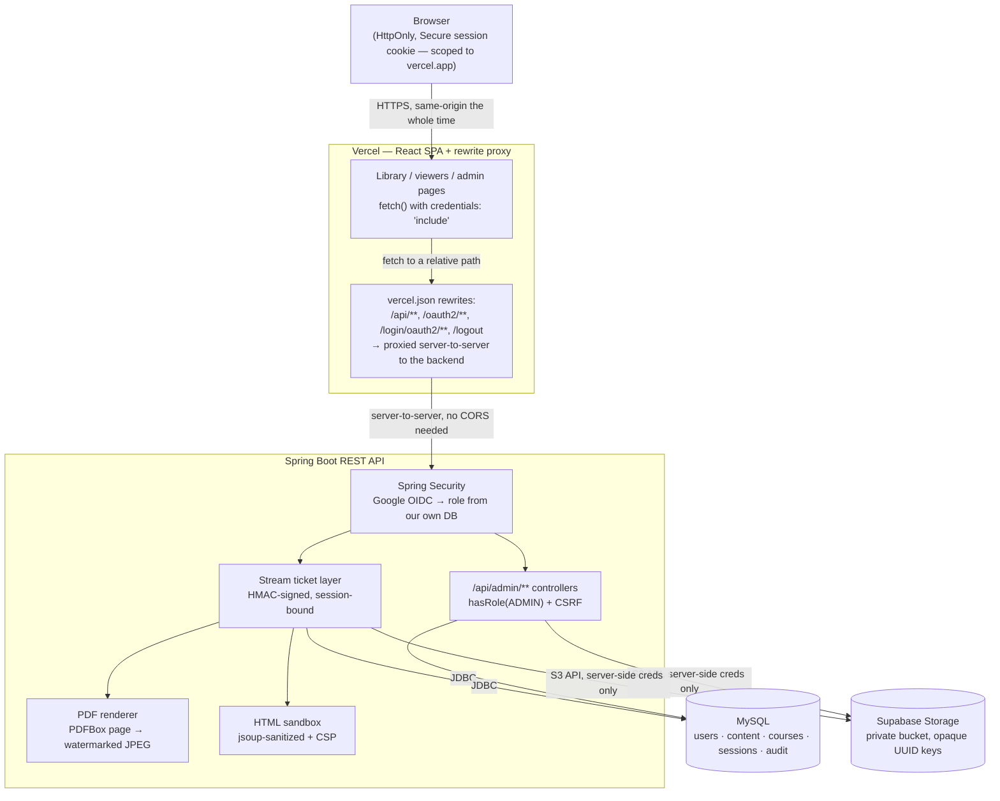

# GradientNovaAI

_(formerly Secure Content Portal; the repository and package names keep the old name)_

A role-based portal for sharing training and reference content — video, PDF, and HTML — inside an
organization. Admins upload and manage content; viewers browse and watch/read it inline, without a
working path to save the original file.

Built for an internship screening assignment. Java Spring Boot was a hard requirement; everything
else below was chosen deliberately, not defaulted to.

**Live app:** https://secure-content-portal.vercel.app (React frontend — talks to the API below)
**API:** runs locally (`./run-local.sh`) — the hosted backend has been retired, see [Deployment](#deployment)
**Repo:** https://github.com/Abishek062006/secure-content-portal

---

## Contents

- [Features](#features)
- [Tech stack, and why](#tech-stack-and-why)
- [Architecture](#architecture)
- [Running it locally](#running-it-locally)
- [Environment variables](#environment-variables)
- [Deployment](#deployment)
- [Content protection — what's real, what's a deterrent](#content-protection--whats-real-what-a-deterrent)
- [Security practices](#security-practices)
- [Testing](#testing)
- [Bonus features implemented](#bonus-features-implemented)
- [Known limitations and assumptions](#known-limitations-and-assumptions)
- [What I'd do with more time](#what-id-do-with-more-time)

---

## Features

**Everyone (after Google sign-in)**
- Browse a searchable, filterable library of videos, PDFs and HTML pages
- Watch video inline with seeking (range-request streaming)
- Read PDFs page-by-page as rendered images
- View HTML pages sandboxed

**Courses** (in development on the `feature/courses` branch — not deployed)
- A course is a set of **modules**, each holding video **lessons** (each with an optional `.vtt` transcript);
  admins build and reorder the outline, add a cover image, and publish it (new courses start as drafts)
- Learners browse the catalog, enroll for free, watch through the signed-ticket, watermarked player with a
  click-to-seek transcript, and see progress: completed lessons, resume position, and percent complete
- A **question bank** per course: questions belong to a lesson, carry a difficulty (easy/medium/hard) and an
  explanation. Admins generate them from a lesson's transcript with AI, type them in, or import a CSV, then
  review, edit and approve. AI questions start as drafts; hand-written and imported ones are approved.
- **Quizzes and assessments.** Each module can end with nothing, a practice **quiz** (instant feedback per
  answer, unlimited retakes) or a graded **assessment** (pass mark, optional time limit and attempt limit,
  optionally required before the next module opens); a course can also have a final assessment. Every attempt
  draws random approved questions by the admin's difficulty mix, with shuffled options.
- **Question difficulty and the final's mix.** Generating questions has a difficulty slider (Mixed, Easy, Medium
  or Hard: pick Hard and all of them are hard) and takes up to 100 at a time. Questions can be saved as *final
  assessment only*. A final assessment has a slider for what share of its questions is recycled from the course's
  regular questions versus new final-only ones; if one kind runs short, the other fills the gap.
- **Course catalog and My learning.** Signing in lands on the catalog: a welcome header with search, "Let's start
  learning" (courses in progress), then **Recommended for you** (courses in domains the learner already studies,
  weighted by popularity), **Popular courses** (most enrollments), **More courses to explore** (the rest, ordered by
  popularity with a steady daily shuffle) and, for domains with three or more courses, **Top courses in <domain>**.
  My learning has a dark header with tabs (All, In progress, Completed, Certifications), a summary and progress
  cards; in the menu it sits last, after Feed. Admins get a plain Courses page (search and preview) instead of the recommendation rows.
- **Admin dashboard.** Admins land on `/admin/dashboard`, which shows learners, enrollments, completion rate and certificates with
  monthly change, a 30-day activity chart (enrollments, new learners, quiz attempts, posts), quiz pass rate and
  average score, the learner journey (enrolled, started, finished, certified), top courses with completion,
  content and community totals, and recent admin activity. Numbers come from `GET /api/admin/analytics`.
- **Background jobs, Redis and RabbitMQ.** Generating questions no longer holds the browser request open: the
  request returns at once with a job, the page shows "23 of 89 questions made" and you can leave and come back.
  Questions are saved batch by batch, so nothing is lost if a later batch fails. Two switches, both off by default so
  the app still needs only MySQL:
  - `QUEUE_ENABLED=true` sends jobs through **RabbitMQ** (a durable queue with a dead-letter queue, two consumers per
    instance) so any app instance can pick them up; off, a small thread pool inside the app runs them.
  - `REDIS_ENABLED=true` moves login sessions to **Redis** (shared by every instance behind a load balancer) and
    shares the request limits and the dashboard cache; off, sessions stay in MySQL and limits and cache live in the
    process.
  Per-user request limits (for example 6 generations, 20 comments and 8 posts a minute, and a generous overall cap)
  answer HTTP 429 with a retry time; `RATE_LIMIT_ENABLED=false` turns them off.
- **Large videos and adaptive streaming.** With S3-compatible storage the browser uploads a video straight to the
  bucket in 16 MB parts (three at a time, each retried if it fails, resumable), and the server only signs the
  URLs and afterwards checks the stored file (its size, and what its first bytes really are) before making the
  lesson, so a 5 GB video never passes through the app. In the background ffmpeg then cuts the video into HLS
  (360p, 720p and 1080p as far as the source goes) and the player switches quality with the viewer's connection.
  Segments are served behind the same session-locked ticket as the video, and the original keeps playing until the
  packaging is ready (or if ffmpeg isn't available). Without S3 (the default local disk) uploads go through the
  server as before.
- **Module materials.** Each module can carry extra study material: PDFs, web pages, small videos (up to 500 MB),
  Word/PowerPoint/Excel/text/CSV/ZIP files, and links. The admin ticks per item whether learners may download it.
  View-only PDFs, web pages and videos open inside the portal with the same protections as library content
  (watermarked page images, sandboxed HTML, session-bound video tickets) and the download endpoint refuses them.
  Documents can't be shown in a browser, so they are always download-only. Materials follow the same rules as
  lessons: learners must be enrolled and the module unlocked.
- **Pricing.** A course is free or paid (whole rupees). A paid course can have a percentage discount, set with a
  slider, that runs for a period: while it is on, learners see the original price struck out, the discounted price,
  the percentage and when the offer ends. Payments are **not** connected yet, so a price is displayed but enrolling
  still doesn't charge anything.
- **Profiles and member posts.** Every member has a profile (cover, photo, headline, location, website, about,
  experience, education, skills) that anyone signed in can view; certificates they earn appear on it as credentials
  that link to the public check page. Any member can post text, a photo or a video, write an article, or share one of
  their own certificates, and delete their own posts; admins can delete anyone's and keep pinning, scheduling and
  course promos. Members are limited to 20 posts an hour. The feed is laid out in three columns (a "you" card,
  "Start a post", recommended courses).
- **Feed reactions and videos.** Six reactions (like, celebrate, support, love, insightful, funny) chosen from a
  row that pops up over the Like button. Posts can carry a photo or a video (up to 500 MB, streamed with the same
  session-bound tickets as lessons). Interface icons are [Lucide](https://lucide.dev) (ISC license), inlined in `components/Icon.jsx`. Reaction artwork is [Twemoji](https://github.com/jdecked/twemoji), graphics
  licensed CC-BY 4.0, stored in `frontend/public/reactions/`.
- **My learning and certificates.** "My learning" lists enrolled courses with progress and a Continue button.
  A certificate is earned by completing every lesson and passing every graded assessment (quizzes are practice
  and never required). It is issued once, rendered as a PDF on the server, and carries an ID that anyone can
  check at `/verify/<ID>` without signing in (the check shows only name, course and date).
- **Feed.** Admins post text with an optional image, pin posts, schedule them for later, or attach a published
  course to make a promo post with an Enroll button ("Promote this course" on the course editor pre-fills one).
  Learners react (like / celebrate / insightful, one each, changeable), comment, and copy a share link. Authors
  can delete their own comments and admins can delete any. Scheduled posts are invisible to learners until
  their time.

**Admins** (seeded via an email allow-list, not self-service)
- Upload video/PDF/HTML with title, description, category
- Edit metadata; delete with a confirmation dialog
- View per-item view counts and last-viewed timestamps
- Audit log of every upload/edit/delete, with who and when

## Tech stack, and why

| Layer | Choice | Why |
|---|---|---|
| Backend | Spring Boot 3.5, Java 21 | The assignment's one hard requirement |
| Frontend | React (Vite) SPA, deployed separately on Vercel | Talks to the backend as a JSON REST API over `/api/**`, routed through Vercel's own rewrite proxy rather than plain cross-origin CORS (see [Architecture](#architecture) for why). Not a same-origin monolith — the earlier same-origin Thymeleaf build is still in this repo's history if you want to see that version |
| UI design | Inter (Google Fonts), CSS custom properties, no component library | Layered shadows, pill-shaped controls, hover/press micro-interactions, per-route fade-up entrances, a glassmorphic sign-in screen with gradient glow accents, and gradient-text page headings — all in `frontend/src/app.css`, applied via the existing shared classes so no page needed individual rework |
| Auth | Spring Security `oauth2-client` | Server-side session only; no JWT in localStorage. Role is decided by *our* database, never trusted from the OAuth response |
| Sessions | Spring Session JDBC (MySQL) | Sessions survive a restart, since they don't live in that process's memory. Planned: move to Redis so several app instances can share them behind a load balancer |
| Database | MySQL 8+ (local for now; AWS RDS/Aurora MySQL when deployed) | Moved from Postgres/Neon by choice; both scale far beyond this app's needs. Flyway owns the schema (`src/main/resources/db/migration`); UUID keys are `BINARY(16)` and timestamps `DATETIME(6)` in UTC |
| File storage | [Supabase Storage](https://supabase.com) (private bucket, S3-compatible API) | 1GB free, no card required, and the S3-compatible endpoint means the code isn't locked to Supabase specifically |
| PDF rendering | Apache PDFBox, 90 DPI | Renders pages to images server-side — see [Content protection](#content-protection--whats-real-what-a-deterrent). DPI kept modest since every render (even a cache hit) still redoes an in-memory decode/watermark/re-encode on a small single-core instance |
| File-type detection | Apache Tika | Magic-byte sniffing — never trusts the filename extension or the browser's `Content-Type` header |
| HTML sanitizing | jsoup | Strips scripts/forms/event handlers at upload time |
| Backend hosting | Runs locally | The hosted backend (Render, then AWS Elastic Beanstalk) has been retired; the API runs from `./run-local.sh` and AWS deployment is planned for last |
| Frontend hosting | [Vercel](https://vercel.com) free tier | Zero-config Vite build, instant deploys on push |

## Architecture



The browser never learns a storage key, never receives a storage credential, never holds a URL
that outlives its session, and never stores an auth token itself — the session cookie is the only
credential, and it's `HttpOnly` so the SPA's own JavaScript can't read it either.

**Why a proxy instead of plain cross-origin CORS + cookies** (the first approach tried): browsers
now block third-party cookies by default, which broke the whole flow for anyone but a session that
happened to already be trusted — sign-in would appear to succeed, but every subsequent `fetch()`
from `vercel.app` to the backend's own domain silently dropped the session cookie. Routing
everything through Vercel's own rewrites means the browser only ever talks to `vercel.app`; Vercel
forwards to the backend server-to-server, so the session cookie ends up scoped to Vercel's own
origin and every API call is same-origin from the browser's point of view. `frontend/vercel.json`
holds the rewrite rules; `VITE_API_URL` is intentionally empty in production so the frontend calls
relative paths. This also means the backend can move — Render to AWS to a laptop, or anywhere else — by
changing only the destination URLs in `vercel.json`; nothing about Google OAuth or the frontend
needs to know or care.

## Running it locally

**Prerequisites:** Java 21, Maven, Node 18+, and the accounts described in
[Environment variables](#environment-variables) (Google OAuth client, a MySQL database, and a storage bucket or the local-disk option).

Backend:

```bash
git clone https://github.com/Abishek062006/secure-content-portal.git
cd secure-content-portal
cp .env.example .env
# fill in .env with your own credentials — see below
./run-local.sh
```

`run-local.sh` sources `.env` and runs `mvn spring-boot:run`. The API starts on
`http://localhost:8080`; Flyway builds the schema automatically on first run.

Frontend (in a second terminal):

```bash
cd frontend
npm install
npm run dev
```

Starts on `http://localhost:5173` and talks to the backend above (`.env.development` already
points `VITE_API_URL` at `http://localhost:8080`). Both need to be running to sign in and browse.

**Local database and storage.** A local run needs no cloud accounts apart from Google OAuth. Create a
MySQL database and user once (MySQL 8+ running on `localhost:3306`):

```sql
CREATE DATABASE secureportal CHARACTER SET utf8mb4 COLLATE utf8mb4_0900_ai_ci;
CREATE USER 'secureportal'@'localhost' IDENTIFIED BY 'secureportal';
GRANT ALL PRIVILEGES ON secureportal.* TO 'secureportal'@'localhost';
```

Then add a gitignored `.env.local` — `run-local.sh` loads it on top of `.env`:

```bash
SPRING_PROFILES_ACTIVE=local
```

The `local` profile (`application-local.yml`) points at that database (override with `LOCAL_DB_URL`,
`LOCAL_DB_USERNAME`, `LOCAL_DB_PASSWORD`) and writes uploads to `./local-storage/` on disk instead of a
bucket (`storage.provider=local`). Flyway creates the tables on first start.

To run the test suite (source both files so the tests use the local profile):

```bash
set -a; source .env; source .env.local; set +a
mvn test
```

The integration tests boot the full app against a **separate** MySQL database, `secureportal_test`, because
they empty tables between cases and must never touch the data you develop with. Create it once
(`create database secureportal_test; grant all on secureportal_test.* to 'secureportal'@'localhost';`); the
app's migrations build its tables on the first run. They need `.env` and `.env.local` sourced. `FileValidatorTest` and `StreamTicketServiceTest` are plain unit
tests with no external dependencies.

### Redis and RabbitMQ with Docker

They are optional. To try them, install Docker Desktop, then from the project folder:

```bash
docker compose up -d redis rabbitmq
docker compose ps
```

Add these to `.env.local` and restart the backend:

```
REDIS_ENABLED=true
QUEUE_ENABLED=true
```

RabbitMQ's dashboard is at http://localhost:15672 (user and password `secureportal` unless you set
`RABBITMQ_USERNAME` / `RABBITMQ_PASSWORD`). If Redis is switched on but not running, sign-in will fail because
sessions can't be stored; switch it off or start it. To check the real brokers end to end:

```bash
set -a; source .env; source .env.local; set +a
BROKERS_UP=true mvn test -Dtest=BrokersIntegrationTest
```

### Object storage and video processing with Docker

The default `STORAGE_PROVIDER=local` keeps files in `./local-storage`. To use an S3-compatible bucket locally (the
same code path production will use with real S3):

```bash
docker compose up -d s3
scripts/copy-local-storage-to-s3.sh        # copies what you already uploaded into the bucket
```

Then add to `.env.local` and restart the backend (use the full path to the project for the two scripts):

```
STORAGE_PROVIDER=s3
STORAGE_ENDPOINT=http://localhost:8333
STORAGE_BUCKET=content
STORAGE_ACCESS_KEY=minioadmin
STORAGE_SECRET_KEY=minioadmin
FFMPEG_PATH=/full/path/to/Secureportal/scripts/ffmpeg-docker.sh
FFPROBE_PATH=/full/path/to/Secureportal/scripts/ffprobe-docker.sh
```

The two scripts run ffmpeg inside Docker, so you don't have to install it (`brew install ffmpeg` and leaving those
two lines out works too). The local S3 server (SeaweedFS) uses throwaway keys and allows browser uploads from
`localhost`. Check the whole path (upload in parts, packaging, ticketed playback, cleanup) with:

```bash
set -a; source .env; source .env.local; set +a
S3_UP=true mvn test -Dtest=DirectUploadIntegrationTest
```

On real S3 the bucket needs a CORS rule that allows `PUT` from your site and exposes the `ETag` header, and
`storage.create-bucket=false`; a CDN in front is the production step after this.

### How quizzes and assessments behave

- **The server owns everything that matters.** It picks the questions, shuffles the options, runs the clock and
  grades. While an attempt is running the browser never receives which option is correct; a submitted
  attempt reveals it. A quiz reveals each answer's result straight away, since it's practice.
- **Timed attempts** are submitted automatically when time runs out (with a few seconds' grace for the
  request to arrive); a learner who leaves and returns finds it already graded. Refreshing resumes the same
  attempt, so a reload never costs one.
- **When things unlock:** a module's quiz or assessment opens once all of its lessons are completed; the
  final assessment once every lesson is; a module opens only after the previous module's *gating* assessment
  is passed. Admins are never locked out, so they can preview everything.
- **Results** for admins: attempts, learners, average score and pass rate per assessment, plus the questions
  learners miss most.

### AI question generation

Generation calls any OpenAI-compatible chat endpoint, so the provider is only configuration. Groq's free tier
works: create a key at console.groq.com, then add this to `.env.local` (pick a current model name from your
provider's model list):

```bash
AI_API_KEY="your-key"
AI_MODEL="a-current-model-name"
# AI_BASE_URL defaults to Groq (https://api.groq.com/openai/v1); set it to use Gemini, OpenRouter, Ollama, ...
```

Without `AI_MODEL` the rest of the app works and the Generate button explains that AI isn't configured.
Rate limits (HTTP 429) are retried automatically. A CSV import needs the columns `question, difficulty,
option1, option2, option3, option4, correct` (correct is 1-4 or A-D) and an optional `explanation`; the
question bank page offers a template.

## Environment variables

All variables are listed with placeholders in [`.env.example`](.env.example). None are committed
with real values.

| Variable | Where it comes from |
|---|---|
| `GOOGLE_CLIENT_ID`, `GOOGLE_CLIENT_SECRET` | Google Cloud Console → APIs & Services → Credentials |
| `DB_URL`, `DB_USERNAME`, `DB_PASSWORD` | Only for a hosted database, e.g. `jdbc:mysql://<host>:3306/<db>`. Local runs use the `local` profile instead |
| `STORAGE_ENDPOINT`, `STORAGE_REGION`, `STORAGE_BUCKET`, `STORAGE_ACCESS_KEY`, `STORAGE_SECRET_KEY` | Supabase project → Storage → S3 Connection |
| `APP_ADMIN_EMAILS` | Comma-separated list of emails that should be promoted to Admin on login |
| `APP_TICKET_SECRET` | Random secret for signing stream tickets — generate with `openssl rand -base64 32`. **Use a different one in production than in development.** |
| `APP_FRONTEND_URL` | The deployed frontend's origin (e.g. `https://secure-content-portal.vercel.app`) — used for CORS and as the post-login/logout redirect target. Defaults to `http://localhost:5173` for local dev |

The frontend has its own, much smaller set: `VITE_API_URL`, the backend's origin — see
[`frontend/.env.development`](frontend/.env.development) and
[`frontend/.env.production`](frontend/.env.production).

## Deployment

The backend is **not currently hosted**: it runs locally with `./run-local.sh` against a local MySQL
database, and the React app runs with `npm run dev`. The Vercel frontend deployment still exists, but its
`frontend/vercel.json` rewrites point at a backend that has been shut down, so the hosted site can't sign
anyone in until a backend is hosted again.

| Piece | Service | Notes |
|---|---|---|
| API | Local (`./run-local.sh`) | Previously Render, then AWS Elastic Beanstalk `t3.micro` — both retired |
| Frontend | Vercel (or `npm run dev` locally) | Static build, no sleep/cold-start |
| Database | MySQL (local now; AWS RDS/Aurora MySQL planned) | |
| File storage | Supabase Storage (or local disk with the `local` profile) | 1GB, 50MB per-file cap on Supabase |
| OAuth | Google Cloud | Free, no verification needed for the non-sensitive scopes used here |

**AWS production deployment.** `infra/terraform` builds the whole stack — CloudFront, an Application Load Balancer, ECS Fargate with
auto scaling, RDS MySQL, S3 and Secrets Manager (optionally ElastiCache Redis, Amazon MQ and WAF) — and
`scripts/deploy-aws.sh` ships releases. Costs, first-deploy steps, scaling and teardown are in [infra/README.md](infra/README.md).

On Vercel, set the project's Root Directory to `frontend/` and leave `VITE_API_URL` **unset** in the
dashboard — the committed `frontend/.env.production` sets it to empty intentionally, and a dashboard
value would silently override that (see gotcha #2 below).

**Hosting history, and why it moved twice:** the API started on Render's free tier, which sleeps after
15 minutes idle and cold-starts in 30–60s. It moved to an AWS Elastic Beanstalk `t3.micro` to avoid that,
then off AWS again to run locally while the project grows into a learning platform. File storage stayed on
Supabase throughout; only the compute layer moved, and because of the proxy it
never needed any change to the Google OAuth config.

**Deployment-specific gotchas worth knowing — all hit for real while building this:**

1. Both Render and, now, Vercel terminate TLS upstream of the container, so without
   `server.forward-headers-strategy=native` (set in `application-prod.yml`), Spring builds the OAuth
   callback URL as `http://` and Google rejects it. This is set correctly here, but it's the first
   thing to check if OAuth breaks only in production and not locally.
2. **Vercel dashboard environment variables silently win over the committed `.env.production` file.**
   `VITE_API_URL` was set once in Vercel's dashboard UI while first wiring up the project, then later
   made intentionally empty in `frontend/.env.production` — but the dashboard value kept overriding
   it on every rebuild, with no error or warning, so the deployed app kept calling Render directly
   instead of through the proxy no matter what the code said. If a Vite env var isn't behaving as the
   repo says it should on Vercel, check the dashboard for a stale override before anything else.
3. **The OAuth "pending request" can't safely live in a cookie or session across the redirect
   through Google, in production.** The natural fix for a proxied setup — store the
   `OAuth2AuthorizationRequest` in a cookie instead of `HttpSession` — worked perfectly when replayed
   with curl (an explicit cookie jar, no real Google visit), every single time, and still failed
   identically in real browsers with `authorization_request_not_found`. The actual fix
   (`StatelessOAuth2AuthorizationRequestResolver` / `...Repository`, in `com.secureportal.config`)
   encodes the whole request into the `state` parameter itself — Google is contractually required to
   echo `state` back verbatim over a plain URL parameter, so there's nothing left for a cookie policy
   or a redirect-chain quirk to interfere with. See the class Javadoc for the full story; this is the
   single most subtle thing in the whole project and worth reading if OAuth-behind-a-proxy ever comes
   up again.
4. Vercel and the backend (Render, then AWS, now local) are genuinely different registrable domains at
   the DNS level, so the session cookie is still `SameSite=None; Secure` in production
   (`application-prod.yml`) as a defensive default — but because of gotcha #3 and the proxy in #2's
   fix, the cookie is actually *set* while the browser is talking to `vercel.app` (proxied), so it
   ends up scoped there rather than to the backend, and every later API call is same-origin from the
   browser's perspective regardless. `APP_FRONTEND_URL` on the backend must still exactly match the
   deployed Vercel origin, for CORS (kept as defense-in-depth) and as the post-login redirect target.

## Content protection — what's real, what's a deterrent

The assignment is explicit that hiding a download button isn't security. Here's an honest breakdown
of what actually stops a determined viewer versus what just discourages a casual one.

### Real boundaries

- **Nothing is served from a public or guessable URL.** Every video byte, PDF page image, and HTML
  page goes through `/api/stream/{ticket}`, `/api/pdf/{ticket}/page/{n}`, or `/api/html/{ticket}` —
  never a direct storage link. The Supabase bucket itself is private; even its raw S3 endpoint
  refuses unsigned requests.
- **Tickets are session-bound, not just expiring.** Each ticket is an HMAC-signed token carrying the
  content ID, the requesting user, a hash of their session ID, a purpose, and an expiry
  (`StreamTicketService`). A URL copied out of devtools and opened in a different browser — even one
  logged into a different valid account — fails immediately, because the session hash won't match.
  Most implementations stop at "the link expires eventually"; this stops working the moment it's
  used anywhere else.
- **The PDF binary never reaches the browser.** Pages are rendered server-side to JPEG with
  PDFBox and served as images. There is no PDF file for the browser to hold in memory and save —
  unlike a client-side viewer (e.g. PDF.js), where the whole file is fetched and sits in the page's
  memory regardless of what UI chrome is disabled around it.
- **HTML is sanitized at upload, not just at serve time**, and delivered inside an iframe with a
  bare `sandbox` Content-Security-Policy — no `allow-same-origin`, so the framed document gets a
  null origin and cannot read cookies, call back to the app, or navigate the parent page.
- **Server-side role checks, twice.** `/admin/**` is enforced at the URL level in `SecurityConfig`
  *and* independently via `@PreAuthorize` on the controller — a routing mistake in one layer can't
  expose an admin action, because the other still catches it.

### Deterrents only

- **Video's watermark is CSS, not pixels.** PDF's watermark is burned into the rendered JPEG
  server-side — a real boundary, since there's no unwatermarked version to recover. Video's is a
  translucent overlay drawn on top of the `<video>` element in the browser (`VideoViewer.jsx`),
  showing the same tiled-diagonal look. True server-side burned-in video watermarking would mean
  real-time per-viewer frame transcoding (ffmpeg), which would fight the simple range-request
  seeking the player relies on and likely be too slow on a free-tier instance's CPU — out of scope
  for what this needed to prove. The brief itself frames this bonus as a deterrent, not a security
  boundary, so this is an honest match for what was actually asked.
- **Right-click "Save Video As" is disabled** (`onContextMenu` preventing the browser's native
  context menu) and native fullscreen is suppressed (`playsInline`, plus an explicit
  `webkitbeginfullscreen` listener backing iOS out of it — Safari ignores `controlsList` for this
  entirely) so the watermark overlay can't be trivially bypassed by handing the video to the OS's
  own fullscreen surface. Both are UI-level deterrents: the underlying stream URL was already
  ticket-gated and session-bound regardless — see [Real boundaries](#real-boundaries) above.
- Nothing here stops a sufficiently motivated person with screen-recording software. That's true of
  any content protection scheme that still has to render pixels to a real screen; the point of this
  design is to stop casual link-sharing and devtools scraping, not to build DRM.

## Security practices

- **Three independent upload checks**: file extension, size ceiling, and the file's actual magic
  bytes via Tika — content wins over both the extension and the browser-supplied `Content-Type`,
  both of which are attacker-controlled. A renamed executable or text file is rejected regardless of
  what extension it's given.
- **No secrets in the repository.** `.env` is gitignored; `.env.example` documents every key with
  placeholder values only.
- **CSRF protection is on** (Spring Security's default) for every state-changing request, including
  logout — which is why logout is a POST form, not a link.
- **HttpOnly, Secure (in production) session cookie.** `SameSite=None` in production, required
  because the frontend and API are on different domains (see [Deployment](#deployment)); `Lax`
  locally, where frontend and backend share the same registrable domain. No token is ever stored in
  localStorage or sessionStorage.

## Testing

```
mvn test
```

| Suite | What it covers | Needs a real DB? |
|---|---|---|
| `FileValidatorTest` (13 cases) | Extension/size/magic-byte checks; a renamed text file or executable is rejected regardless of its extension or claimed `Content-Type` | No |
| `StreamTicketServiceTest` (8 cases) | Tampered signature, payload swapped under a stolen signature, wrong session, no session, expired ticket | No |
| `AccessControlTest` (9 cases) | Anonymous/viewer/admin against every `/api/admin/**` route, the delete route, `/api/content`, and all three content-delivery endpoints, through the real Spring Security filter chain | Yes |

## Bonus features implemented

- Per-item view count and last-viewed timestamp, visible to admins only
- Search and filter on the library (title/description text search, content type, category)
- Watermarking the viewer's email onto video and PDF views as a deterrent (server-side/real for
  PDF, CSS overlay for video — see [Deterrents only](#deterrents-only))
- Audit log of admin actions (upload/edit/delete, and admin grant/revoke) with actor, timestamp
  and detail
- Access-control test suite (see [Testing](#testing))

All five bonus items from the brief are implemented.

## Known limitations and assumptions

- **PDF page-render cache isn't swept on delete.** Deleting a PDF removes its database row and the
  original file, but cached rendered pages under `derived/<id>/` in storage are left behind — they're
  unreachable (nothing can mint a ticket for a deleted item) but not reclaimed.
- **Video's watermark is a CSS overlay, not burned into the file**, unlike PDF's. See
  [Deterrents only](#deterrents-only) for why that's the honest trade-off here, not an oversight.
- **No silent ticket refresh for long videos.** A video ticket is valid for 30 minutes; a video
  longer than that would need to be reloaded. Chosen over building refresh logic given the time
  available — see below.
- Assumed "basic view tracking" (a stated bonus) means a raw count is enough — no per-user dedup, no
  analytics dashboard.

## What I'd do with more time

- Silent stream-ticket refresh for the video player, so long videos don't hit the 30-minute ceiling
  mid-playback
- Real server-side video watermarking (ffmpeg-based frame transcoding) instead of the CSS overlay,
  if the seeking/CPU trade-offs it brings turned out to be worth it
- HLS-based video delivery instead of a single progressive stream, for adaptive quality
- A scheduled job to sweep orphaned PDF page-render caches after a content item is deleted
- Rate-limit ticket minting per user, as a defense against a compromised session being used to
  script mass content scraping
